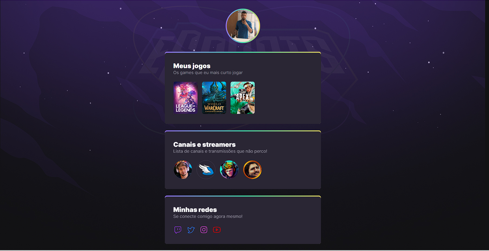

<div align="center">

<h1></h1>


This application was developed during Next level week, made by [Rocketseat](https://rocketseat.com.br/). 🚀

</div>

<div align="center">

[]()
[]()
[]()

[](https://discord.gg/rocketseat)
</div>

## ▶ Preview

[](https://guiorlandin-nlwesports.netlify.app)

## 📃 About

Page for descripton a gamer

## 🎨 Layout

- [Layout Figma - Original](https://www.figma.com/file/CuUc233J4G55qgRTB3a6yh/NLW-eSports-(Community)-(Community)?node-id=79%3A2502)

## 🛠 Build with

- [HTML]()
- [CSS]()

## 🎞 Demo



## ⚙ Features


## 💻 Getting started

```sh
git clone https://github.com/GuiOrlandin/NLW.git && cd NLW
```

Download [live server](https://marketplace.visualstudio.com/items?itemName=ritwickdey.LiveServer) extension on vscode and run.